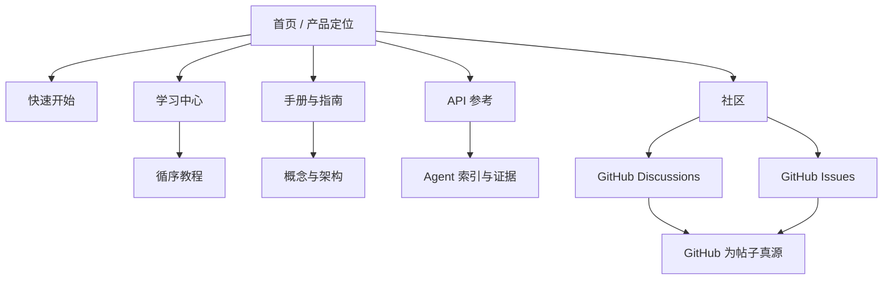
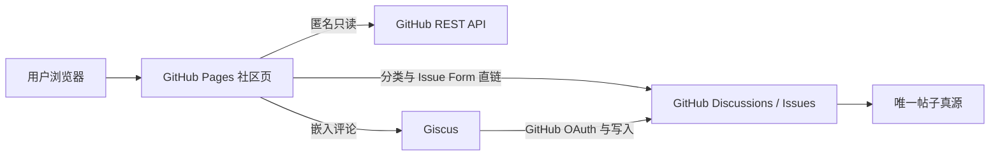
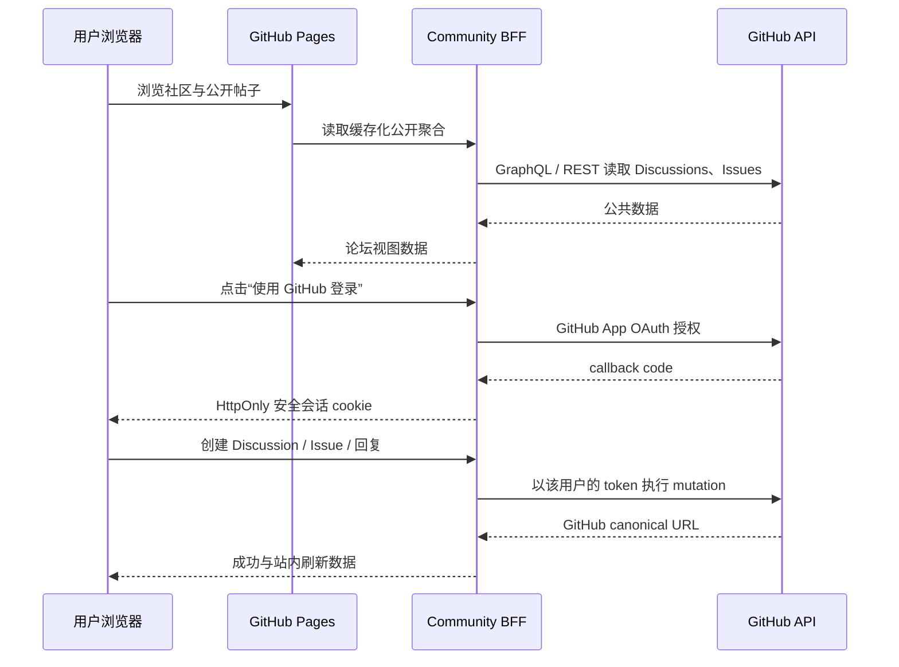

# Infernux 网站革新计划

## 实施快照（2026-07-16）

第一轮基础革新已落入 `docs/`：

- 完成首页、Wiki、Roadmap 的 SEO / Open Graph / canonical / PWA 基础，以及 `robots.txt`、根 sitemap 与自定义 404。
- GitHub Pages 自定义 404 已从单语静态孤岛升级为双语 NASA Punk 恢复台：完整复用八项任务导航、主题/语言/移动菜单、当前版本文档搜索、PWA 更新生命周期与严格 CSP。无脚本时仍保留学习中心、首页和 GitHub 的绝对路径恢复动作；有脚本时可直接打开与全站同源的双索引检索，并明确提示主页面 `Ctrl/⌘ + K` 与生成文档 `/` 快捷键。404 保持 `noindex`、不把任一普通任务误标为当前页，嵌套失效 URL 也不会因相对路径再次迷航。正式域名巡检不再只接受 HTTP 404 状态，还会验证搜索、双语包、导航和安全策略确实出现在返回体；响应式、i18n、运行时资产和总体验证门禁同步覆盖该恢复面。
- 完成共享导航的键盘操作、焦点样式、跳转正文、移动端菜单语义和 `prefers-reduced-motion` 支持；Logo 负责返回首页，根站与全部生成文档统一为 `开始使用`、`学习`、`手册`、`API`、`路线图`、`社区`、`下载`、`GitHub` 八个任务入口。开始使用与 API 会随中英文切换进入同语言深链，各内容层用 `aria-current="page"` 标出当前位置；1180px 以下抽屉继续突出“开始使用”和“社区”。静态门禁会逐页核对顺序、路由、语言与当前页语义。
- 首页首屏已按“先获得首个结果、再决定安装”的转化路径重排：同语言“开始第一个项目”为主行动，下载为次行动并紧邻 Windows 10/11 x64、0.2.1 技术预览和平台边界；基准测试与 GitHub 作为文本级证据入口。基准区不再使用脱离上下文的竞品等级标题，改为列出 1080p、硬件、60 帧预热、300 帧采样、实际 FPS 与着色复杂度/批处理/编辑器成熟度差异，并链接 arXiv 方法和完整数据表；截图延迟加载且保留固有尺寸。
- 首页 `mover.py` 起步组件现提供独立的双语复制动作：从渲染后的代码节点提取纯文本，保留缩进、空行与最终换行，不把语法高亮 HTML 写入剪贴板；Clipboard API 失败时使用只读回退，成功/失败通过文字、图标、`data-state` 与 polite live region 同步反馈。手机端收敛为 44px 图标按钮，首页专用 CSS/JS 不扩大全站共享负担；隔离测试、响应式门禁、PWA 与部署巡检共同覆盖。
- 建立中英双语 Learn / Manual 第一条主路径：快速开始、第一个组件、引擎地图，并完成 MkDocs 静态构建。
- 建立 `llms.txt`、`llms-full.txt`、`docs-index.json`、`docs-manifest.json` 和可搜索 Wiki catalog；全文语料确定性拼接双语手写文档与紧凑 API 目录，支持 Agent 离线和长上下文检索。
- Agent 的紧凑发现入口 `llms.txt` 不再作为独立静态清单手工维护。新增确定性生成器从 `docs-manifest.json`、`docs-index.json`、`api-index.json`、`learning-paths.json`、`docs-health.json` 与 `release.json` 组合 25.3 KiB 导航：完整列出 40 篇策划文档及状态/版本/验证日期、First Flight 双语步骤、36 个带人工示例或显式知识关系的英文 API 与中文 counterpart、manifest 声明的全部发现表面、当前发布校验/签名边界和 Agent 信任规则。正文 SHA-256 指纹覆盖完整生成区，64 KiB 硬预算、独立覆盖测试、两条 Pages 工作流、总体验证器和正式部署巡检会拒绝漏页、漏索引、版本漂移、指纹不一致、本地路径泄漏或人工改写；`llms-full.txt` 继续承担完整正文检索，不把紧凑入口膨胀成第二份语料库。
- 新增社区页：匿名读取最新 Discussions、分类路由、Issues 分流和 Giscus 留言墙；帖子数据仍只位于 GitHub。
- 已验证仓库 Discussions / Issues 处于启用状态；Giscus 的一次性管理员操作见 `dev/INFERNUX_COMMUNITY_SETUP.md`。
- Giscus GitHub App 已完成安装并通过公开 category API 验证，仓库 ID、General 分类与页面配置一致；定时 readiness 检查已移除允许未安装的临时豁免。GitHub 直接协作者审计确认当前只有 `ChenlizheMe` 且角色为 `admin`，社区页面以 `data-community-administrators="ChenlizheMe"` 明文声明唯一管理员，同时明确真正的管理权限仍由 GitHub 强制执行，前端名单不授予权限。
- 第二轮补齐了“构建并分享”课程、场景与对象手册、调试手册，中英内容保持一一对应。
- 新增自动生成的 `api-index.json`（模块、符号类型、签名、状态、双语 URL 与 canonical）以及纯 Node 文档索引生成器。
- 新增网站质量门禁：front matter、双语配对、源码证据路径、Markdown 内链、HTML 无障碍、i18n、SEO、Giscus 配置、索引一致性和严格 MkDocs 构建。
- 第三轮补齐输入与时间、物理、屏幕空间 UI、资源与 `.meta`、渲染与 RenderStack 手册；当前索引包含 26 篇双语/架构文档与 158 条本地化 API 符号。
- 为 `InxComponent`、`GameObject`、`serialized_field`、`Input`、`Time`、`Rigidbody`、`Physics`、`UICanvas` 建立可在 API 再生成后恢复的人工维护层，提供版本状态、最小示例和相关教程/手册。
- 生产构建会移除未引用的 Material 运行时与 MkDocs sourcemap，并执行两层静态体积预算：生产资源面总量当前为 1150.4 KiB / 1.25 MiB，生成 Wiki 为 5652.8 KiB / 8 MiB；另按真实 HTML 引用、CSS 字体依赖、去重图片和 `<picture>` 最重候选计算五条首访路径，首页、Wiki、Roadmap、社区、下载分别为 490.4 / 500、377.4 / 400、280.6 / 300、344.6 / 360、310.5 / 320 KiB。总体尚余 99.6 KiB，首页只余 9.6 KiB，后续视觉或交互资产必须优先通过替换、按需加载或减重获得空间，不能恢复无约束累加。
- 根页面多语言资源已从“每页下载完整 307 条双语文案”改为“3.7 KiB 共享运行时与导航文案 + 6.0–16.5 KiB 当前路由词典”；按页面减少约 38.6–49.1 KiB 首访脚本，同时删除 5 个确认未使用的旧键。人类仍只维护 `docs/tools/i18n-source.json` 一份源词典，`build-i18n.mjs` 确定性生成五个路由 bundle，拒绝中英键不一致、空文案、未使用键或生成物漂移；隔离测试验证共享键、本页键、跨页文案不泄漏和 8 KiB 核心上限，部署巡检逐个请求生成资源。
- 新增每 6 小时执行的正式域名健康检查，覆盖首页、Wiki、社区、双语文档、机器索引和真实 404 状态。检查器现在生成 schema 1 JSON 审计报告，逐项记录目标、类型、通过/失败/跳过、耗时和失败详情；通过 GitHub Pages 官方 latest-build API 记录真正发布的 commit、构建状态与时间，同时单独保留线上 `docs-manifest.json` 声明的文档 source commit，避免把 workflow checkout SHA、Pages commit 与文档源 SHA 混为一谈。GitHub Actions run summary 显示两条 commit 链和统计，原始报告即使检查失败也会上传并保留 30 天；本地预览明确把 Pages 证据标为 skipped。纯 Node 测试覆盖 schema、计数、两类 commit、失败 Markdown 转义、重复 ID、非法时间/checkout SHA，并由两个发布工作流强制执行。
- 社区 v1 决策为继续采用“公开 Discussion 列表 + GitHub 创建入口 + Giscus 登录/回复墙”；暂不增加 BFF。只有需要站内任意话题详情、创建与回复时才引入 GitHub App + Worker。
- 第四轮新增 2D 基础、3D 基础、动画工作流与音频工作流四条任务型 Learn 路径，均包含预计时间、完成标准、分步验证、常见失败与中英对应页面。
- 为 API 建立不可变版本快照与 `api-changes.json`。0.2.1 是第一个权威基线；因为没有更早快照，页面明确报告“无可比较版本”，后续发布由 CI 计算新增、移除与结构变化。
- 新增 `/download.html` 与 schema 2 `release.json`：展示 Hub 安装器和 CPython 3.12 Wheel 的 GitHub 原始地址、文件体积与 SHA-256；生产健康检查会把线上清单逐项对照 GitHub 最新 Release。下载页现在明确区分“文件与已审阅产物是否一致”的 SHA-256 证据和“发布者是谁”的身份签名：当前清单如实标记独立发布者签名 `not-declared`，不再把校验和描述成签名验证；浏览器只接受匹配本仓库、当前 tag、两个唯一产物种类、安全文件名、正整数体积和 64 位十六进制摘要的清单，异常时保留内置 v0.2.1 权威链接而不渲染可疑地址。页面同时提供 GitHub 全部 Releases / 旧版本入口，Release Note 渲染也移除 `innerHTML` 清空路径；独立隔离测试、两条 Pages 工作流和正式域名巡检共同覆盖这一信任边界。
- 158 个双语 API 页面已全部标记示例状态：28 个本地化页面含人工验证示例，130 个明确说明暂无已验证示例；不再向用户或 Agent 暴露 `TODO: Add example` 占位文本。
- 社区页已公开说明本地偏好、公共 GitHub 数据、Giscus 登录边界和外部网络请求，并提供 GitHub 授权撤销与 GitHub/Giscus 隐私政策直链。
- 顶级导航在 1180px 及以下切换为可滚动抽屉，覆盖 820–1080px 容易拥挤的平板与小桌面区间；菜单项保持至少 44px 触控高度。打开后焦点进入首个任务链接，Tab / Shift+Tab 在菜单按钮与八个入口间形成闭环，Escape 关闭并返回按钮，导航外点击关闭，桌面断点、语言切换和链接激活都会清理状态；背景滚动被锁定而抽屉可独立滚动。隔离测试覆盖焦点进入、循环、返回、中英文标签、外部关闭与桌面保护，并已接入质量和发布工作流。
- Space Grotesk、Inter、JetBrains Mono 与站点实际使用的 Font Awesome 图标已自托管，并记录上游版本、许可证和 SHA-256；根页面不再依赖 Google Fonts 或 cdnjs。Font Awesome 不再以“CSS 类子集、完整字体文件”的形式发布：31 个 solid glyph 与 GitHub/Python 两个 brand glyph 已生成真实 WOFF2 子集，总体积由约 252 KiB 降至约 4.7 KiB。CSS 声明精确 `unicode-range`，静态门禁同时锁定 glyph 映射、文件哈希和 16 KiB 上限，部署检查会请求两份字体并验证 WOFF2 文件头与体积，防止未来无意恢复完整上游字体。
- 首页、学习中心、路线图、社区与下载页现有完整的 Open Graph/X 图片尺寸与替代文本，并以 `WebSite`、`SoftwareApplication`、`CollectionPage`、`LearningResource` 等 JSON-LD 描述页面关系；质量门禁会直接解析这些结构化数据。
- 社交分享图不再直接复用 1245×653 的编辑器证据截图。`infernux-social-card-0.2.1.jpg` 以真实 `demo.png` 编辑器捕获和仓库 Logo 为输入，形成独立的 1200×630 NASA Punk 任务卡；正文仍保留原始截图作为可复核产品证据，社交卡只承担品牌传播，不作为性能证明。资产记录公开说明 AI 辅助合成边界、来源、尺寸和 SHA-256；静态门禁锁定 JPEG 类型、实际尺寸、审阅哈希、与 `release.json` 一致的版本化文件名，以及五个根页面和全部可索引生成文档中的 Open Graph、X Card 与 JSON-LD 声明。正式域名健康检查还会直接请求图片，验证响应类型、文件头、体积、尺寸和哈希，避免分享平台收到损坏或过期产物。
- 首页的 1245×653 编辑器证据现通过 `<picture>` 按 AVIF → 无损 WebP → 原始 PNG 渐进增强：AVIF 为 52.5 KiB，相比 354.0 KiB PNG 减少 85.2%，使用 4:4:4 编码并经解码测得 PSNR 47.03 dB、MAE 0.3971；WebP 为 188.5 KiB，减少 46.7%，逐像素解码误差为零。三者保持相同固有尺寸、替代文本、延迟加载和异步解码，JSON-LD 继续指向原始 PNG，避免把有损传输变体当作新的证据真源。独立门禁解析 PNG/WebP/AVIF 文件结构和尺寸，锁定 SHA-256、Release 版本化文件名、候选顺序、体积收益、CSS `aspect-ratio`、资产溯源与两个发布工作流；正式域名还会逐个检查 MIME、文件头和哈希，本地服务器的 WebP 通用 MIME 兼容仅限 loopback。性能预算按一名访客实际可能收到的最重候选计费，而不是把三个互斥格式相加，同时仍逐文件执行上限。
- 全部可索引的生成式 Learn / Manual / Architecture / API 页面也已补齐独立 Open Graph、X 大图卡片、语言区域、文章分区、标签与 Schema.org JSON-LD：任务型 Learn 使用 `LearningResource`，技术手册、架构和 API 使用 `TechArticle`，每页同时提供指向 canonical 的 `BreadcrumbList`。质量门禁会遍历每个生成 HTML、实际解析 JSON，并核对类型、语言、图片、canonical 与面包屑；生成式 404 明确 `noindex` 且不再冒充文档 canonical。
- 文档工具链按已验证范围限制为 MkDocs 1.x、Material for MkDocs 9.x 与 PyMdown Extensions 10–11.x，避免自动依赖升级跨入未经验证或已声明不兼容的下一主版本。
- Wiki 人类搜索入口使用由文档内容 SHA-256 派生的 catalog 文件名；每次生成自动更新 HTML 引用并清理旧 hash，不再依赖人工递增 `?v=` 查询参数。
- 同一 catalog 现在还会在构建期向 `wiki.html` 注入 40 个安全转义的双语策划文档链接，按 Learn / Manual / Architecture 分组并携带状态、起始版本与验证日期；关闭 JavaScript、简单爬虫或索引请求失败时仍能浏览权威目录和机器索引。动态搜索成功后才接管目录，失败时保留静态内容；生成器会拒绝越出预期 Wiki 路径的 URL，质量门禁逐项核对 40 个链接且禁止目录运行时再使用 `innerHTML`。
- Wiki 人类搜索已支持按 Learn / Manual / Architecture 层级、Stable / Preview / Experimental / Deprecated 状态、分类与标签组合过滤；筛选和查询写入 URL，搜索排序同时识别版本、最后验证日期和目标受众。
- Wiki 文档卡片直接展示状态、起始版本与最后验证日期；生成后的 Learn / Manual / Architecture 页面展示完整 provenance、同主题语言切换和可访问的代码复制控件。
- 文档 manifest 新增构建 provenance：生成流水线写入完整源 commit、GitHub commit URL 和源 commit 时间；本地工作树保持显式 `unstamped`，避免用脏工作树伪造发布追溯信息，线上健康检查则强制要求 `stamped`。
- 每个可索引的生成文档现在会在阅读尾部直接显示 documented release、发布状态、构建 commit 与 UTC 生成时间，并保留机器清单入口；正式 commit 链接必须同时满足 40 位 SHA、指定仓库和精确 URL，异常值不会变成可点击链接。本地预览明确显示“未签名”，而不是用当前分支伪装成发布证据；双语文案、手机单列、无 JavaScript 回退、隔离测试和逐页静态门禁共同覆盖这项可信度契约。
- 生成后的 API / Learn / Manual / Architecture 页面新增全局双语搜索：直接合并 `api-index.json` 与 `docs-index.json`，支持 `/`、`Ctrl/Cmd+K`、Escape 和焦点循环；不再发布自定义模板从未加载的 Material/Lunr 运行时、全部语言包与重复搜索索引。搜索面板现提供当前语言/跨语言、Learn/Manual/Architecture/API 层级及 Stable/Preview/Experimental/Deprecated 稳定性筛选；默认不倾倒全部 198 条记录，选择层级或状态后可无关键词浏览，精确 API 符号仍优先于泛匹配教程。面板同时显示由两份索引一致性证明的 documented release；在只有 0.2.1 一套索引时不伪造无意义的版本下拉，等真正发布第二个可并存版本再启用版本切换。筛选控件由共享脚本安全创建，避免把同一组表单复制进 202 个 HTML；窄屏使用 44px 原生控件与受控横向滚动，焦点循环和快捷键会识别 `select`。独立测试覆盖真实索引、版本分叉拒绝、中英组合、层级/状态浏览、排序与结果上限，并进入两个工作流。
- Wiki 首页的主搜索框也会在存在查询时合并同语言 API 符号；默认浏览仍只展示 40 篇策划文档，避免把 79 个 API 卡片一次性铺满页面。
- 与旧提交相比，发布产物删除约 1.74 MiB 未引用的 Material bundle、样式、Lunr 多语言包与重复 search index；健康检查会直接请求新的搜索脚本、样式和 API 页面搜索契约。
- `UpdateLog.md` 现在确定性生成 `release-notes.json`，包含版本、发布时间、比较基线、摘要、5 个分组与 15 条变更/升级说明；下载页安全渲染同一数据，Agent 全文语料同步收录，版本工作流无需维护第二份 Release Note。
- 生成 API 页在 768px 以下把命名空间树收为默认折叠目录，保留当前符号名称与 44px 目录按钮；桌面断点恢复完整侧栏，ARIA 展开状态与断点变化同步，不再让手机首屏被半屏目录占据。
- 移动端 API 目录的行为与样式已抽取为根站共享资源，不再内联复制到约 200 个生成页面；严格重建后生成 Wiki 从约 7.50 MiB 回落到 6990.6 KiB，并由部署健康检查直接验证这两个共享资源。
- 社区公开话题列表已升级为可搜索、可筛选、可排序的小论坛视图：分类之外还可选择“待回答问题 / 已回答问答 / 已锁定话题”，并在已经加载的话题中按最近活动、最新发布、回复数或 reaction 数排序。查询、分类、状态与非默认排序都写入 URL，可分享并支持浏览器前进/后退；默认视图继续保持干净 canonical URL。列表可逐页加载更早话题并安全合并去重；话题卡显示 canonical 编号、回复数、非零 reaction、已回答和已锁定状态。分页位置与最小公开元数据只在当前标签页缓存五分钟，缓存 schema 升级会主动丢弃缺少创建时间、可回答属性或 reaction 计数的旧记录；手动刷新会回到第一页并绕过缓存。GitHub API 或更早页加载失败时保留现有结果与原生 Discussions 全量入口。远端字段只通过 `textContent`/DOM 节点渲染，社区脚本禁止使用 `innerHTML`。
- 每张社区话题卡现拆分为可打开的主链接和独立 44×44px 分享动作。支持 Web Share 的手机直接打开操作系统分享面板，载荷只有归一化后的话题标题和本仓库 `/ChenlizheMe/Infernux/discussions/<number>` GitHub canonical URL；浏览器通过 `canShare` 拒绝该载荷或不支持 Web Share 时，按钮从一开始就显示“复制讨论链接”，再使用 Clipboard API 与只读、屏幕外 textarea / `execCommand` 降级。用户取消系统分享属于中性操作，不会意外写入剪贴板或显示错误；其他原生分享故障才安全回落到复制。卡片更新时间同时改为带原始 ISO `datetime` 的 `<time>`，视觉日期继续按当前中英文 locale 格式化，便于辅助技术和机器理解。整个动作不读取正文、账号、Cookie 或 token，也不增加网络请求与存储；按钮以 class / `data-state` 呈现结果，约 2.2 秒后恢复，统一 polite live region 提供双语反馈。规范 URL 拒绝、原生成功/取消、`canShare` 降级、复制失败、机器时间、触控尺寸、键盘焦点、窄屏、强制颜色与 CSP 均进入社区隔离测试、响应式门禁、总体验证器和正式部署巡检。
- 社区客户端隔离测试现覆盖 GitHub canonical URL 白名单、安全数据归一化、复合搜索、分类/问答状态筛选、四种稳定排序、URL 编解码与非法参数回退、缓存 reaction 保真、中英文控件文案、分页缓存和恶意 URL 拒绝；CI、静态门禁与部署健康检查同时验证社区脚本、样式和缓存版本。
- General、Q&A、Ideas 与 Show and tell 四个 GitHub Discussion 分类现各有对应 slug 的双语结构化表单；字段围绕话题背景、目标/尝试、问题/提案、媒体/经验与相关版本收集最低必要上下文。社区频道卡不再只有一个模糊落点，而是分别提供“浏览”和“发布话题”两个 44px 操作，创建链接直接携带 category 参数进入对应表单；Issues 继续使用已有 Bug、Feature、Question 三个 Issue Forms。网站门禁会反向核对四个分类的浏览 URL、创建 URL、表单文件名、唯一字段 ID、双语 label 与至少一个必填字段；模板路径同时进入网站质量工作流触发范围。
- 社区页新增独立双语“工程队列”，把 Bug report、Feature request 与需要工程化追踪的 Question 从首屏泛化 Issue 入口拆成三张任务卡。每张卡同时提供按 `bug`、`enhancement`、`question` label 浏览现有开放事项的只读入口，以及直接进入 `bug_report.yml`、`feature_request.yml`、`question.yml` 的结构化创建入口；开放讨论仍明确回到 Discussions，避免把论坛闲聊混入工程队列。页面不请求额外 API，也不接触登录态或写入内容；提交继续由 GitHub 原生页面完成。静态门禁会把页面浏览 URL、模板 URL、真实 Issue Form 文件及其 label 反向对照，部署巡检确认三个队列和三个表单入口实际发布，中英文资源版本同步更新。
- Giscus 社区墙现在采用两级、隐私优先的按需加载：匿名访问只下载论坛列表逻辑，不再把 Giscus 配置、错误分类、iframe 消息验证和主题同步状态机放进社区首访或 PWA 核心。访客点击双语“加载回复”后，页面先请求同源、约 10 KiB 的 `/js/community-giscus.js` 控制器；只有该控制器成功初始化后才创建 `giscus.app/client.js`。在当前标签页通过 `sessionStorage` 记住选择的访客会自动恢复这条链路；控制器请求失败不会接触第三方，并显示可重试的双语 OFFLINE 状态与 GitHub 原生入口。控制器参与 Service Worker 版本指纹但不进入首次安装，访问后才进入可更新的运行时缓存。状态面板继续区分待命、检查、可用、未安装、限流/认证降级、未知超时与其他错误；消息必须同时来自精确 `https://giscus.app` origin 和当前 `iframe.contentWindow`，不能由另一个同源窗口伪造。重试已有 iframe 时直接重新加载 frame，不重复执行官方客户端或累积 message listener。官方客户端会注入 `giscus.app/default.css`，并在父页面动态设置 iframe 的 `opacity` 与 `height`；因此社区 CSP 只为该页放行 Giscus script/style/frame，并把内联权限缩到 `style-src-attr`，不允许第三方或本站注入内联 `<style>`。前端仍禁止直连不允许站点跨域读取的 categories API；隔离测试覆盖同源控制器先行、未授权零第三方请求、显式 opt-in、会话恢复、动态配置、双重来源拒绝、错误分类、状态优先级与无重复监听器重试。
- 社区墙新增始终可见的双语“前往 GitHub 登录”退化动作：它是用户主动点击的 `github.com/login` 原生入口，`return_to` 被固定为 `/ChenlizheMe/Infernux/discussions`，不携带 `client_id`、`client_secret`、token、callback 或自定义 redirect URI。这样即使 Giscus 尚未安装，用户仍可在 GitHub 完成身份验证并返回本仓库论坛；静态站不会感知登录结果，也不会读取 GitHub Cookie、账号或令牌。客户端隔离测试、HTML 总体验证器和部署巡检会共同拒绝站外 origin、开放重定向参数、敏感参数或单语按钮。
- 每个生成的 API / Learn / Manual / Architecture 页面现在声明独立 canonical、同页中英 `hreflang`、`llms.txt` 和对应 JSON 索引；“复制给 Agent”控件会生成包含权威 URL、文档版本、状态、验证日期、构建 commit、摘要、签名、源码证据和信任规则的结构化 Markdown 上下文。
- 命名空间展开与代码复制逻辑已从约 200 个 HTML 页面抽入共享的生成页脚本，并与 Agent 上下文功能共用安全剪贴板降级；本轮使生成 Wiki 从 6990.6 KiB 进一步下降到 6632.1 KiB。隔离测试同时覆盖 curated/API 两类上下文、发布 provenance 与本地 `unstamped` 警告。
- 生产优化器会从 MkDocs 模板确定性提取唯一共享布局样式，生成 `wiki-template.<content-hash>.css`，清理旧哈希并把全部 202 个生成页面改写为同一引用；严格检查禁止共享样式重新内联，部署健康检查会重新计算 CSS SHA-256 并核对文件名。生成 Wiki 因此从 6632.1 KiB 降至 4232.9 KiB。
- 根站和生成文档现共用根作用域 PWA：核心预缓存不再把全部 CSS/JS、全部机器索引、内容哈希 catalog 与平台安装图标强制下载，而是从首页、Wiki、路线图、社区、下载页、自定义 404 和离线恢复页的真实 CSS/JS 引用确定性推导，并只额外保留人类检索所需的紧凑指南索引、学习路径模型与最近文档存储规则。当前版本为 `9a04b93112a2a487`，核心 shell 为 43 项、668.4 KiB，并由 768 KiB 硬预算约束。43 项中包含五个主页面及 404 共同使用的检索界面、各入口的精简双语词典、首页起步复制动作、`docs-index.json`、`learning-paths.json` 与有界最近文档运行时，因此首次离线启动仍能检索 Learn、Manual 与 Architecture，能从当前设备的 First Flight 进度解析下一步骤，也能在已经访问的文档间恢复最近阅读；更大的 `api-index.json`、生成页运行时、Giscus 同源控制器和哈希资源继续在访问时缓存进独立的持久 `runtime-v1`。若某个旧版本曾把如今的核心资源写进运行时缓存，激活阶段会主动清除该重复项；核心版本升级时仍保留其余运行时缓存，旧版核心缓存里已经访问过的非核心资源也会先迁移进去。运行时缓存按成功访问或刷新顺序保留最多 96 项，写入或配额失败只放弃缓存，不会用错误响应替换已经成功取得的网络内容。54 项核心/按需输入共同参与版本指纹，因此减重不会让文档数据、脚本或延后加载控制器的更新逃过新版本提示。五个主页面和独立 404 继续完整离线，直接启动 manifest 的 `/` 在网络不可用且尚未形成 `/` 缓存键时会明确回退到预缓存的 `/index.html`；未访问的生成文档仍进入双语 NASA Punk 恢复页，不会伪装为完整离线 Manual。
- 安装后的 Web App 不再只有“下载、文档”两个泛化快捷方式。Manifest 现在按产品任务顺序提供 Start、Docs、Community、Download 四个受控入口，分别直达首个教程、Wiki 检索台、GitHub 驱动社区与校验下载页；每项都有完整名称、短名称、用途描述和已审计 192px 图标，不新增重复图片。构建会拒绝缺项、乱序、重复 URL/名称、越出根 scope、缺失描述、错误图标或不存在的目标页面，正式部署巡检直接验证四项均已发布。共享主题运行时同时把 `<meta name="theme-color">` 与深浅主题同步：恢复本地浅色偏好时在首次交互前切换为 `#f4f1e8`，人工切换主题时立即更新浏览器/PWA 系统栏，未知状态安全退回深色 `#0a0c11`；隔离测试覆盖恢复和双向切换，仍不写内联视觉样式。
- PWA 不再把 256×256 透明站点 logo 当作唯一安装图标：manifest 现提供 Chromium 明确检查的 192×192 与 512×512 不透明图标、单独的 512×512 maskable 图标和 `prefer_related_applications: false`，另为 Apple 主屏幕提供 180×180 touch icon。maskable 版本把完整徽记收进规范定义的 40% 半径安全区，避免 Android 的圆形或圆角遮罩切掉火焰与熔炉；门禁直接解码索引 PNG 与滤波扫描行，测得非背景像素最大半径 141.52px，小于 512px 画布的 204.80px 安全半径。各资源由仓库 logo 机械派生并记录 Pillow 版本、几何、体积与 SHA-256。独立门禁同时锁定实际尺寸、无透明通道、审阅哈希、manifest 角色、shortcut 图标、根页面/生成模板引用和资产溯源；安装图标由浏览器平台按 manifest 获取，门禁反向保证它们不会被站点再次塞进核心预缓存。正式域名检查仍逐文件验证 MIME、文件头、体积、尺寸与哈希。
- 下载页现把“安装引擎”和“安装文档 Web App”明确拆开：后者只承诺独立窗口、快速启动、离线外壳和已访问页面恢复，并直说不会安装引擎或预下载完整 Manual。Chromium 只有真正触发 `beforeinstallprompt` 后才显示安装按钮，且必须由用户点击才调用一次系统 `prompt()`；站点不自动打断浏览。`appinstalled`、独立显示模式、接受、取消、失败和无直接提示均有双语状态；iOS Safari 显示“分享 → 添加到主屏幕”，其他 iOS 浏览器提示转到 Safari。交互不使用 localStorage/sessionStorage，不注入 HTML，也不伪造跨浏览器安装能力。隔离测试覆盖显式用户操作、一次性提示、已安装状态、iOS Safari/非 Safari、延迟降级和实时语言切换；CI、静态门禁和正式域名巡检会验证页面、脚本、样式与缓存版本。
- 已安装站点不再依赖用户猜测何时刷新：共享运行时同时检查注册时已存在的 `registration.waiting` 与后续 `updatefound → installed` 状态，只有当前页面已经受旧 worker 控制时才显示右下角 NASA Punk 双语更新提示；首次安装不会制造一次多余刷新。用户可以延后当前版本，新的 worker 仍会再次出现；只有明确点击“立即更新”后才向等待中的 worker 发送 `SKIP_WAITING`，并在 `controllerchange` 后恰好刷新一次。提示使用 `aside`、独立 polite live status、44px 按钮、手机双列/窄屏单列适配以及 forced-colors 降级，不抢夺当前焦点，不使用持久存储、内联样式或 HTML 注入。隔离测试覆盖 waiting、updatefound、首次安装、延后、新版本重现、中英切换、重复点击与无授权 controllerchange，并由两条 Pages 工作流和正式域名产物检查锁定。
- Service Worker 隔离测试覆盖依赖推导后的精确 shell、768 KiB 预算、首次安装不抢跑、用户消息激活、旧版非核心资源迁移、跨版本运行时缓存保留、新增核心资源从运行时缓存去重、首次离线指南索引恢复、96 项上限与按刷新顺序淘汰、配额失败时仍返回成功网络响应、`/` 到真实首页恢复、未访问导航回退、其余机器索引网络优先、哈希资源首次按需/后续缓存优先和跨域 GitHub 请求旁路。此前安装阶段自动执行 `skipWaiting()` 会绕过用户确认更新，现已移除；首次安装仍按浏览器默认生命周期激活，替换 worker 只有收到前端“立即更新”发送的 `SKIP_WAITING` 才越过等待阶段。部署检查继续直接请求 manifest、worker、安装图标和离线页。
- 全站文档检索不再局限于生成文档：主页、Wiki、路线图、社区、下载页与 404 均加载同一份双语搜索运行时，导航栏或恢复动作提供 44px 入口，`Ctrl/Cmd+K` 可从任意根页面打开；生成文档继续支持 `/`，Wiki Hub 的 `/` 保留给原有内嵌目录检索以避免快捷键争用。搜索面板独立请求同版本的 `docs-index.json` 与 `api-index.json`，支持语言、内容层级与稳定性筛选；两份索引不再“一损俱损”，API 不可用时继续显示指南，指南不可用时继续显示 API 符号，并用双语状态说明当前结果边界，只有两者都失败才进入完整错误态。重新打开面板会重试此前缺失的索引，输入和筛选过程中不会反复制造网络请求；根页面切换中英文时仍同步界面文案和默认语言范围。面板使用原生 modal dialog；不支持原生 modal 的回退路径会显式把页面其余内容设为 `inert`，键盘可用方向键、Home、End 在结果间移动，Esc 关闭后把焦点还给原触发器。打开检索还会关闭移动导航，避免两个焦点域同时存在；静态门禁与隔离测试锁定六个根入口、部分索引模型、恢复重试、原生/回退隔离、双语同步和键盘顺序。
- 全站搜索新增始终可见的双语“在 Wiki 中继续”结果入口：它把当前查询、语言、Learn/Manual/Architecture/API 层级和稳定性编码为 `/wiki.html` 的可分享 URL，而不是要求用户在新页面重新输入。显式 `?lang=en|zh` 会优先于旧的本地语言偏好并成为当前偏好；未知值不会污染状态。Wiki 首次加载时区分“初始化语言事件”和后续人工切换，避免初始化事件在 URL 恢复前删除 `q`、`layer` 或 `status`；人工切换语言后保留查询、层级和稳定性，只清除语言相关的 category/tag。`layer=api` 现在是显式可浏览层：无查询时只有用户主动选择 API 才加载 API 卡片，默认目录继续保持 40 篇策划文档；有查询时仍合并指南和 API。继续入口不混入方向键结果集合，Tab 焦点循环仍可到达它；隔离测试、总体验证、版本化资源、Service Worker 与部署巡检共同锁定这条跨页面连续链。
- 主页 1245×653 运行证据图已从“AVIF → WebP source → 354.0 KiB PNG 最终回退”收敛为“52.5 KiB AVIF → 188.5 KiB 无损 WebP 最终回退”；WebP 解码结果与原 PNG 的 MAE 和最大通道误差均为零，因而结构化数据也改为指向实际交付的 WebP。原始 PNG 没有删除或篡改，仍由中英文 README 引用并作为哈希、尺寸、AVIF 质量和无损编码的审阅真源，但主页不再引用它。体积门禁现明确区分浏览器可能选择的互斥交付候选与仓库证据源：以最重交付路径计费，同时继续逐文件校验三种编码，根体验由 1231.4 KiB 降到 1065.9 KiB，释放 165.5 KiB，避免用“所有格式相加”或“完全忽略最重回退”两种方式歪曲预算。
- 根 `sitemap.xml` 不再手工维护 21 个代表性页面或依赖搜索引擎自行合并第二份 sitemap；生成器从五个根 canonical、文档索引、API 索引和三个 Wiki 入口确定性生成 206 个唯一 URL。200 个本地化页面各自声明 `en`、`zh-CN` 与 `x-default`，并以 `last_verified` 作为稳定 `lastmod` 证据。
- sitemap 生成会拒绝缺失页面、缺少语言 counterpart、重复 URL、站外 canonical 和非法日期；CI 检查生成物新鲜度，部署健康检查再读取线上 `docs-index.json` / `api-index.json` 并证明 206 个 canonical 全覆盖。`robots.txt` 只声明这一份权威 sitemap，减少重复发现与人工漂移。
- `learning-paths.json` 现提供可供网页与 Agent 共用的 First Flight 学习契约：三步分别完成编辑器与场景、第一个组件、独立构建，总耗时诚实标注为 25–40 分钟，并把第 2 步标记为“首个可运行结果”里程碑。三个双语 Learn 页面会渲染响应式步骤条、完成标准、进度计数和 44px 操作按钮；完成状态仅保存在当前设备的 `localStorage`。Wiki 首页新增同源“任务记忆”卡：无记录时给出起点，部分完成时定位第一个未完成步骤，全部完成后转为复盘入口；返回缓存页面、切换语言或另一标签页更新进度时都会刷新，且明确说明不做账号同步。学习路径模型已进入关键离线缓存，损坏存储、乱序完成、中英文 URL、首次离线启动与工作流接入均有独立测试；隐私说明、Agent 全量语料、manifest、Service Worker、CI 和本地部署检查保持同步覆盖。
- Wiki 首页新增“最近阅读”连续性区域：全部生成的 Learn、Manual、Architecture 与 API 页面只记录 canonical 路径、标题、层级、状态和访问时间；不会保存正文、搜索词或账号信息。记录按 URL 去重、最多八项、180 天过期，拒绝站外路径、404、损坏数据、超期值和异常未来时间；首页只显示当前语言最近四项，并提供 44px 清除按钮。清除前先把焦点移回 Start Here 标题，切换语言、浏览器返回或另一标签页修改记录时会同步刷新；无记录时整个区域保持隐藏。独立共享脚本避免生成页与 Wiki Hub 使用两套格式，社区数据说明、缓存版本、202 个生成页面、两条工作流、隔离测试和部署检查均已同步。
- 全部 202 个生成式 Learn / Manual / Architecture / API 页面新增显式双语“打印 / 保存 PDF”操作，只在用户点击后调用浏览器打印界面，不自动下载或上传内容。打印版移除导航、侧栏、搜索框、阅读尾栏、复制与学习进度等交互外壳，保留面包屑、版本状态、文档来源与构建证据；标题避免孤立分页，代码块自动换行，表格按页面宽度排版并重复表头，图示和学习轨道尽量保持为完整块。纸张、墨色、分隔线和表格网格使用共享 `--print-*` 语义令牌并进入对比度审计；独立测试验证显式用户授权、双语标签、打印 CSS、令牌使用、模板版本和 202 页产物，两条 Pages 工作流与正式部署检查同步锁定。
- 阅读尾栏的双语复制操作使用统一的当前章节模型：初始 URL 中的正文 H2/H3 hash 会建立章节状态，随后自然滚动跟踪的可见章节会取代已经过时的 hash；回到首个 H2 之前则恢复复制权威 page canonical。动作会在“复制页面链接”与“复制章节链接 / Copy section link”间同步切换，并从 canonical URL 构造安全编码的精确深链，而不是复制可能带运输参数的地址栏文本。代码行号、搜索对话框、未知 hash 和异常几何不会被误当成正文证据；只接受 HTTP(S) canonical，异常或复制失败会显示可读失败状态。按钮使用单一键盘焦点，并通过 polite live 文本、禁用中状态、文字与图标共同反馈结果。纯函数测试覆盖空格、中文、旧 hash 替换、可见章节优先、页首复位、非法协议与损坏 URL，202 个生成页面、总体验证器、部署巡检和既有 CI 文档上下文测试均已同步。
- 双语文档切换现在能在结构可证明一致时保留当前章节，而不是一律把读者送回页首。因为英文标题使用可读 slug、中文标题由 MkDocs 生成 `_2/_3…`，共享运行时不会盲目复用 hash，而是把当前 H2/H3 的一基序号、页面章节总数与标题层级作为一次性 query 参数写入目标语言链接；目标页仅在总数、序号与 H2/H3 层级同时匹配时替换为本地真实 hash 并滚动，随后立即用 `history.replaceState` 清理运输参数。参数损坏、超出 200 项、结构或层级不一致时清理后停在页首，不猜测对应关系，也不使用 localStorage/sessionStorage。普通文档的 provenance 语言链接和 API 侧栏语言链接使用同一契约；当前自动审计证明 100 对页面中 99 对可安全保留章节，JIT 架构页因中英章节结构不同使用明确页首回退。独立测试逐对检查 counterpart、H2/H3 形状、静态 HTML 无运输参数、202 页运行时版本与两条 CI 工作流接入。
- `docs-index.json` 已升级到 schema 3，并从 `mkdocs.yml` 确定性记录每篇策划文档的权威阅读顺序；First Flight 在侧栏与机器索引中都固定为“快速开始 → 第一个组件 → 构建并分享”，质量门禁会拒绝路径顺序分叉。全部生成页面新增双语面包屑和 44px 响应式阅读尾栏：策划文档按层级、API 按模块提供上一篇/下一篇，支持复制 canonical 链接；“反馈文档问题”会在 GitHub Issue 中预填页面、documented release、状态、验证日期与构建 commit，不引入新的用户数据或站点数据库。
- 阅读尾栏新增面向人类贡献者的安全源码入口：Learn / Manual / Architecture 使用索引中的权威 Markdown 路径生成“在 GitHub 编辑本文 / Edit this page”，API 因为 Markdown 由工具生成而只提供“查看生成 Markdown / View generated Markdown”，避免暗示直接编辑不会被覆盖。路径必须严格位于当前语言与当前层级的 `docs/wiki/docs/` 子树，拒绝 `..`、外部 URL、错语言、错层级和非 Markdown；新窗口统一使用 `noopener`。同时修正全部 provenance 源码证据链接，使其使用仓库实际默认分支 `master`，不再指向不存在的 `main`。四项尾栏操作在桌面采用 2×2 NASA Punk 控件、手机回落为单列 44px 触控项；纯函数、模板、202 页构建产物、部署巡检和静态门禁共同覆盖。
- 策划文档中真实存在的 `../api/*.md` 交叉链接现在会确定性生成 `related_api` symbol key，`api-index.json` schema 3 同时生成反向 `related_documents`；当前 20 篇双语文档形成 112 条关系边，70 个本地化 API 符号可反查解释它们的教程或手册。验证器会拒绝悬空符号、错误语言、元数据不一致、非双向关系和中英分叉；单页“复制给 Agent”与 `llms-full.txt` 都会携带同一知识图，不再要求 Agent 从长 HTML 猜测关联。
- 40 篇 Learn / Manual / Architecture 双语文档现全部显式声明计划要求的 `title`、`description` 与 `related_api`，不再依靠生成时猜测字段缺失的含义；SEO 使用人类可读 `description`，Agent 继续使用独立 `agent_summary`。确定性同步工具以 H1、摘要和已验证知识图为来源，可检查或修复全部 11 个 front matter 字段；CI 会拒绝标题/H1 不一致、描述为空或超长、关系字段类型错误，以及源文档与机器索引漂移。
- 新增确定性 `docs-health.json` 与 Wiki 首页双语 NASA Punk 文档遥测面板，集中展示 198 条本地化内容记录、40 篇策划文档、158 个 API 符号、Stable/Preview/Experimental 分布、28 个已验证 API 示例、112 条知识关系、验证日期和 120 天复核策略。正式发布显示并链接精确构建 commit，本地预览明确标记 `unstamped`；超过复核周期或出现缺失日期时自动转为警示。健康报告同时进入 Agent 全量语料、单页 Agent 上下文、manifest、PWA、客户端测试、CI 与部署检查；根 HTML/CSS/JS/JSON 改动现在也会触发离线产物再生成。
- 全部生成的 Learn / Manual / Architecture / API 页面提供双语“本页目录”：从已有 H2/H3 稳定锚点安全生成，桌面默认展开、768px 以下默认折叠，用户手动选择优先；目录按钮和手机链接保持至少 44px。目录现在不仅识别 URL hash，还会以粘性导航底部作为阅读边界，在自然滚动、窗口变化和浏览器页面恢复时跟踪最后一个进入正文区域的章节，并以 `aria-current="location"` 同步高亮；滚动事件为 passive，几何读取由单次 `requestAnimationFrame` 合并，不在每个事件中重复改写。阅读区仍处于首个 H2 之前时明确回到页面级状态；“复制页面/章节链接”使用同一当前章节模型，因此无需先点击目录即可复制正在阅读的 canonical 深链。它不自动改写 URL、不制造历史记录，也不使用 localStorage/sessionStorage；异常几何、编码或 hash 不会中断正文。无 JavaScript 时目录容器保持隐藏，正文与 MkDocs 永久锚点不受影响；当前 99 个英文内容页中 98 个多章节页面可获得该能力，最长可导航 26 个章节。
- 根站、社区、下载、Wiki 及全部生成文档现共享 Windows `forced-colors` 与 `prefers-contrast: more` 契约：装饰星空/阴影在系统高对比度下退出，控件与边框交给 Canvas 系统色，焦点和 `aria-current` / `aria-pressed` 使用 Highlight 轮廓，不再只靠 NASA Punk 红绿状态色表达；独立离线页拥有同等降级。`text-size-adjust: 100%`、长标题/符号任意换行、表格单元格窄屏断行和 API 首列最小宽度共同支撑浏览器 200% 文本放大；静态门禁与部署检查会验证共享样式版本和强制颜色规则确实发布。
- 新增统一的响应式结构回归门禁，覆盖首页、Wiki、Roadmap、社区、下载、404、离线恢复页以及代表性的 Learn / API 生成页；它会核对设备 viewport、375 / 768 / 1440px 对应的窄屏分支与桌面基线、44px 触控目标、搜索和文档目录折叠、长文本与 API 表格换行、图示容器滚动及 `text-size-adjust`，并由网站质量与 Wiki 发布两条工作流共同执行。该门禁证明的是可审计的 HTML / CSS 契约，不冒充真实渲染结果；430 / 1024px、横屏手机、浏览器 200% 缩放后的视觉溢出，以及 Giscus iframe 的移动端行为仍保留为正式域名人工/浏览器验收项。
- 颜色对比不再只靠人工声明。新增纯 Node 设计 token 审计，确定性检查深色、浅色、独立离线恢复页与打印纸张的 262 组前景/表面组合：普通正文、次级文字、链接、状态、代码语法色和强调按钮至少 4.5:1，打印正文至少 7:1，控件边界、焦点与打印分隔线至少 3:1；当前最低正文为 4.63:1，最低 UI 边界为 3.12:1。熔岩红现在拆分为可读链接色与按钮填充色，避免同一红色同时承担深色背景前景和白字背景这组不可能同时满足的职责；浅色主题的红/琥珀/绿/蓝状态色、深色注释代码、`text-soft`、边框以及离线页小字已按角色修正。可读前景禁止在组件内继续写十六进制或 `rgba()` 字面量，两个发布工作流均执行该门禁；打印语义令牌同步后 CSS 缓存契约为 `style.css?v=17`，正式域名健康检查会确认新 token 和版本实际发布。
- Manual 新增可同时服务人类和 Agent 的语义图示链路：Markdown 用纯文本保留无脚本与检索兜底，生产优化器把受控标记升级为带 `figure`、标题、类型和可访问名称的 NASA Punk 系统图，Agent 全量语料则把展示标记归一化为普通 `Diagram (type)` 描述。当前中英文共 16 个实例覆盖项目/场景所有权、组件生命周期、RenderStack 数据管线、固定步物理、输入意图跨帧、资源 GUID 身份链与 UI 指针事件传播；移动端允许图内受控横向滚动且不拖动整页。输入、资源与 UI 页还新增“使用/避免”选型表。静态验证会拒绝标记泄露、非法类型、双语形状分叉、图数不足和缺少 hierarchy/timeline/pipeline/decision 覆盖，并固定核对七个关键 Manual 的图类型；部署健康检查会直接请求新增双语页面与共享样式确认真实产物。
- 五个主页面、404、离线恢复页与全部 202 个生成文档现采用早置的静态 Content Security Policy 和 `strict-origin-when-cross-origin` referrer policy。默认页面只允许同源脚本、样式、字体、图片、连接、Worker 与 manifest，并禁止 object、frame、HTML 内联事件、内联 `<style>` 和 `style` 属性；Wiki 入口原有的 `<noscript><style>` 已迁移为独立的同源回退样式，生成页三处布局属性也已迁入内容哈希 CSS。社区页仅额外放行 `https://api.github.com` 的公开读取以及 `https://giscus.app` 的脚本、加载样式和 frame；因为当前 Giscus 客户端需要动态设置 iframe 高度与透明度，所以只在该页保留 `style-src-attr 'unsafe-inline'`，仍禁止内联样式块。离线恢复页为了单文件可靠性保留唯一内联 `<style>` 例外，但用 `style-src-attr 'none'` 禁止属性样式。主题、语言与移动菜单已从 `onclick` 迁移到共享脚本的 `addEventListener`，离线重试改为原生导航。生产优化器会机械同步生成页，静态门禁逐页核对完整策略、外部动作绑定、共享脚本版本以及零内联事件/样式，部署检查再抽查真实产物。由于 GitHub Pages 不能在仓库内直接配置自定义响应头，这一阶段使用 `<meta http-equiv>`；它不应被误认为已经提供 `frame-ancestors`、CSP 报告或完整响应头防护，未来若引入可配置响应头的 CDN/托管层，应把同一策略提升为 HTTP header 并补充这些能力。
- 本站运行时视觉状态已收敛为 class / data-state 契约：导航滚动态和进入动画不再从脚本写颜色、透明度、位移或 transition，剪贴板回退节点也改用共享 CSS 类，因而深浅主题、设计 token 与强制颜色模式有统一接管点。需要特别说明：`style-src-attr 'none'` 会拦截 `style` 属性、`setAttribute('style', ...)` 与 `cssText`，但浏览器对直接写 `element.style.property` 的处理并不等同于这些属性注入；本次迁移是为了消除视觉漂移与审计盲点，而不是把原代码误报为必然被 CSP 阻断。构建门禁现在枚举 `docs/css` 与 `docs/js` 的全部发布资源，拒绝未被任何 HTML 引用的文件及本站脚本的运行时样式写入；因此已删除从未加载却曾被预缓存的 `roadmap.js`，同时清理共享脚本中无调用者的旧复制与 tab 函数。隔离测试覆盖滚动状态、进入/退出观察、减少动态效果与零内联视觉变更，并在两条 Pages 工作流中强制执行。
- 根目录新增 `update_api_docs.bat` 作为收尾运维入口：在同一 shell 激活 `infernux`，增量生成双语 API Markdown，保留 USER CONTENT 人工区，生成缺失符号页并删除已移除符号页，随后同步人工维护层、机器索引、文档健康、Agent 两级语料、MkDocs HTML、sitemap、PWA 与总体验证；本地刷新刻意不改不可变 API 快照和发布 provenance。新增 Wiki 配置归一化器会在 Python 生成后恢复 First Flight 的策划顺序并禁用未使用的 MkDocs 搜索插件，两条 Pages 工作流共同锁定。实际连续执行证明 158 个本地化 API 符号及全部派生产物最终内容 SHA-256 零变化，失败时 BAT 会立即停止并保留明确退出码。
- API 维护与网站发布现已明确分层：`update_api_docs.bat` 是面向维护者的 API Markdown 扫描、增删与整理入口；全部 GitHub Actions 禁止调用 `generate_api_docs.py`，也不会因为 `python/Infernux/**` 变化而隐式改写 API。API 发布快照与版本差异同样不由 Actions 猜测或改写，必须在维护者明确提升 documented release 时单独处理。`build-wiki.yml` 只校验已提交 API、配置与人工策展，然后自动完成 catalog、机器索引、健康报告、Agent 语料、MkDocs、静态优化、sitemap、Service Worker、全站测试和生成物提交；GitHub Pages 继续沿用当前仓库发布方式。`website-quality.yml` 在 PR/push 中执行其余只读新鲜度检查，并把根 BAT 本身纳入触发范围。正常网站更新不要求维护者在 GitHub 设置页增加 secret、手动运行伴随 workflow 或执行额外部署步骤。

收尾优先级：由人类作者使用 `dev/templates/manual.en.template.md` 与 `dev/templates/manual.zh.template.md` 编写和核验后续 Manual；Agent 只负责骨架、机械同步、链接与构建检查，不再自动扩写正文。Giscus 已安装，剩余工作是正式域名上的非管理员登录/回复/reaction、管理员管理动作和手机端验收；主引擎 API 稳定后再为 0.2.2 生成第一份真实差异。若产品目标扩展到完全站内发帖，再启动 GitHub App + Worker/BFF，而不是把 OAuth secret 放入 Pages。

Giscus 外部阻塞已解除（2026-07-16 实测）：GitHub 仓库公开，Discussions / Issues 均已启用，Giscus category API 已返回与页面一致的 Repository ID 和 General Category ID。定时健康检查现使用硬门禁，不再允许未安装状态通过。

当前 API 发布决策仍需人工保留：工作树生成的 API 已与发布后的不可变 0.2.1 快照发生漂移，独立差异工具会列出 added / removed / changed 及具体字段，并拒绝 `--record-current` 覆盖既有快照。为避免 Actions 替维护者做错误版本决策，常规网站构建不会调用该工具；主仓稳定并准备发布 API 时，必须明确选择“从 v0.2.1 源重新生成网站”或“提升 documented release 并创建新快照”，不能静默改写历史。

## 1. 目标、边界与成功定义

本计划将 `docs/` 下由 GitHub Pages 托管的官网，从“有展示页与 API 文档的项目主页”升级为四个统一入口：

1. **产品入口**：让陌生访客在一分钟内理解 Infernux 是什么、适合谁、当前成熟度如何。
2. **学习入口**：以类似 Unity Learn / Manual 的路径帮助用户完成第一个项目，而不是直接落入 API 字典。
3. **知识入口**：让人类与 Agent 都能稳定发现、检索、引用并验证官方资料。
4. **社区入口**：用 GitHub Discussions 与 Issues 作为唯一帖子数据源，提供论坛式阅读、登录与发帖体验。

本计划只覆盖网站、文档、GitHub Pages、GitHub API、站点构建与相关部署配置；不包含 C++、Python 引擎运行时、编辑器或 Hub 的功能改造。

### 成功指标

- 新用户可在 10 分钟内完成“下载/安装 → 创建项目 → 第一个场景 → 第一个 Python Component → 运行”。
- 关键文档可被稳定深链、全文检索，并具有明确的版本、状态、最后验证时间和源码出处。
- Agent 能通过机器可读索引和稳定 URL 找到权威资料，且不会把过时 API 当作当前能力。
- 手机宽度 375px 下首页、学习页、文档页、社区页均可单手操作，没有非预期横向滚动。
- 未登录者可浏览公共内容；登录 GitHub 后可创建 Discussion、Issue 与回复；帖子仍只存在于 GitHub。
- 首页、Wiki、社区和下载入口具备基础 SEO、Open Graph、无障碍与发布后健康检查。

## 2. 现状与核心决策

### 2.1 当前基础

- GitHub Pages 当前从 `master:/docs` 发布，自定义域名为 `infernux-engine.com`。
- `docs/` 现有官网首页、Roadmap、Wiki 入口；视觉语言已形成 NASA Punk 的煤黑、熔岩红与工程遥测风格。
- `docs/wiki/` 使用 MkDocs Material 生成 API 文档，并已拥有中英文 API 页面和 sitemap。
- `docs/tools/i18n-source.json` 是根站中英文案单一真源，构建期生成共享运行时与五个路由词典；`docs/assets/wiki-docs.json` 已作为手写文档目录。
- 社区需求已有明确前提：GitHub Issues / Discussions 是帖子真源，v1 不建立自定义帖子数据库。

### 2.2 必须坚持的产品决策

| 决策 | 结论 | 原因 |
|---|---|---|
| 官网技术栈 | 保持静态 `docs/`，逐步模块化 CSS/JS | 对 GitHub Pages 友好，迁移成本低，不为重写而重写。 |
| 文档系统 | 保留 MkDocs API；新增学习型文档层 | API 参考与教程的阅读目标不同，不能相互替代。 |
| 社区真源 | GitHub Discussions + Issues | 利用 GitHub 身份、通知、审核、搜索和长期存档，不复制论坛数据。 |
| 登录架构 | v1 使用 Giscus + GitHub OAuth；不自建会话 | 满足社区墙回复且无需让 Pages 接触 OAuth secret/token；仅在完全站内写入成为明确需求时增加 GitHub App + 极小 BFF。 |
| 公开阅读 | 尽量匿名、缓存化 | 访客不应先登录才能看论坛，且应降低 GitHub API 限流压力。 |
| 写入操作 | 必须登录、最小权限、以用户身份执行 | 帖子作者、审核记录和 GitHub 通知必须保持原生归属。 |

## 3. 目标信息架构



已实施的顶级导航固定为：Logo 返回`首页`，其后依次为`开始使用`、`学习`、`手册`、`API`、`路线图`、`社区`、`下载`、`GitHub`。根站和 MkDocs 生成页使用同一任务顺序；开始使用与 API 直达当前语言内容，学习与手册落到可筛选的 Wiki 层级，当前内容层以 `aria-current` 标明。1180px 以下统一收入可滚动抽屉，并保留“开始使用”和“社区”两个高优先级动作。

## 4. 第一阶段：官网转化、SEO 与可信度

### 4.1 首页重构原则

首页不应试图列举所有子系统，而应回答四个问题：

1. **它是什么？** C++17/Vulkan 原生运行时与 Python 生产层的开源游戏引擎。
2. **为什么不同？** 原生热路径、可脚本化工作流、可阅读且可改造的架构、MIT。
3. **现在能做什么？** 以“已可用 / Preview / Roadmap”状态明确展示，而非把所有能力视为同等成熟。
4. **我下一步做什么？** 下载 Hub、五分钟快速开始、查看示例项目、加入社区。

首页首屏 CTA 已按以下顺序实施：

- 主按钮：`开始第一个项目`，直接进入当前语言 Quickstart；
- 次按钮：`下载 Hub 安装器`，并通过可访问描述关联 Windows 10/11 x64 与技术预览边界；
- 文本入口：`查看基准测试`、`查看 GitHub`。

保留编辑器实机截图，但性能数据必须同时附上场景、分辨率、构建类型、硬件、采样时长和复现路径。避免无证据的竞品等级比较；使用“技术预览”“Preview”“实验性”等状态标签建立可信度。

### 4.2 SEO、分享与发布完整性

为 `index.html`、`roadmap.html`、`wiki.html`、未来社区页补齐：

- 唯一的 `meta description`、canonical URL、语言替代链接；
- Open Graph 与 X Card（标题、描述、1200×630 社交图）；
- `SoftwareApplication` / `OpenSourceProject` JSON-LD，包含许可证、仓库、下载页、版本与支持平台；
- 根目录 `robots.txt`、聚合 sitemap、品牌化 `404.html`；
- `manifest.webmanifest`、主题色、可缓存 favicon；
- 发布版本、更新时间和支持平台的单一数据源，避免首页、Roadmap、README 三处手工漂移。

社交图使用与页面一致的 NASA Punk 排版与熔岩红识别色；不应使用通用截图或仅有 logo 的占位图。

### 4.3 下载与安全页

新增 `/download.html`，清晰列出：平台、当前稳定版、文件大小、SHA-256、签名/校验方式、最低系统要求、安装说明、已知限制、更新日志与旧版入口。下载按钮继续指向 GitHub Releases；官网不镜像二进制。

当前静态实现已明确标注 SHA-256 与发布者身份签名的边界；当 Release 没有声明独立签名时显示 `not-declared`，不得使用“已签名清单”等措辞。旧版本只通过 GitHub Releases 权威归档入口发现，网站不复制旧二进制或伪造其支持状态。

## 5. 第二阶段：类 Unity 的学习型 Wiki

### 5.1 文档分层

MkDocs API 是“查一个符号怎么用”的正确工具，但不是“学会引擎”的正确入口。目标文档分为五层：

| 层级 | 目标读者问题 | 示例 |
|---|---|---|
| Quickstart | 如何在十分钟内跑起来？ | 安装、创建项目、运行首个场景。 |
| Learn 路径 | 如何按任务学会做一类内容？ | 2D 小游戏、3D 场景、UI、物理、动画。 |
| Manual | 一个系统的概念、边界和工作流是什么？ | Scene、AssetDatabase、RenderStack、Prefabs。 |
| API Reference | 某类、函数、枚举的精确契约是什么？ | `GameObject`、`RenderGraph`、`Rigidbody`。 |
| Architecture / Contributor | 引擎内部为何这样设计、如何贡献？ | Native/Python 边界、序列化、渲染图、构建。 |

推荐目录：

```text
docs/wiki/docs/
  learn/{en,zh}/
    getting-started.md
    first-project.md
    first-component.md
    first-build.md
    2d-foundations.md
    3d-foundations.md
  manual/{en,zh}/
    scenes-and-gameobjects.md
    components-and-lifecycle.md
    assets-and-meta.md
    rendering-and-renderstack.md
    physics.md
    ui.md
    animation.md
    debugging-and-profiling.md
  architecture/{en,zh}/
  api/{en,zh}/              # 自动生成，禁止手改
```

每页固定 front matter：`title`、`description`、`status`、`since`、`last_verified`、`audience`、`tags`、`related_api`、`source_paths`、`agent_summary`。其中 `last_verified` 不是生成日期，而是该内容对当前发布版本实际验证的日期。

### 5.2 Unity 式学习体验

- Docs 首页首屏改为 **Start Here**：安装 → 第一个项目 → 第一个脚本 → 运行/保存 → 构建；API 作为第二入口。
- 每篇 Learn 文档均有：先决条件、预计时长、完成标准、可复制代码、检查点、常见失败、下一步链接。
- Manual 文档使用概念图、对象关系图、生命周期时间线和“何时使用 / 何时不要使用”。
- API 页在自动生成后加入“概念入口”“最小示例”“相关 Manual”“版本状态”；不要只展示签名。
- 每个 API 符号提供稳定锚点、复制链接、语言切换、面包屑、前后页与关联类型。
- 文档状态统一使用 `Stable`、`Preview`、`Experimental`、`Deprecated`，并在 API、教程和 Roadmap 同时呈现。

#### 人类作者边界

- Manual 的概念解释、示例代码、系统边界、诊断结论和“使用 / 避免”判断由人类作者编写并确认；Agent 不得把推测性正文直接写入公开 Wiki。
- Agent 可以生成非发布的 Markdown 骨架、同步中英文结构、检查 front matter、链接、API 符号、证据路径和严格构建结果。
- 可复制骨架位于 `dev/templates/manual.en.template.md` 与 `dev/templates/manual.zh.template.md`；它们保留占位符且位于 `docs/` 之外，因此不会进入 Wiki、Agent 语料、搜索索引或 sitemap。
- 只有在人类作者清除占位符、核对当前版本 API、运行或明确标注示例状态并完成中英文对应检查后，才把文件复制到 `docs/wiki/docs/{en,zh}/manual/` 并加入导航。

### 5.3 面向 Agent 的知识接口

Agent 不应依赖抓取长 HTML 再猜测权威性。除人类可读页面外，新增由文档构建生成的机器可读表面：

```text
/docs-index.json            # 所有可公开文档：URL、标题、语言、标签、版本、状态、摘要
/llms.txt                   # 精简目录与导航说明
/llms-full.txt              # 可选，适合离线/长上下文检索的拼接正文
/api-index.json             # API 符号、模块、签名、页面 URL、since、状态
/docs-manifest.json         # 构建版本、Git SHA、生成时间、兼容引擎版本
```

`llms.txt` 必须由上述 manifest、索引、学习路径、健康报告和发布清单确定生成，作为不超过 64 KiB 的首跳发现入口；它不能再独立手写，也不能省略任何策划文档或 manifest 声明的机器表面。`llms-full.txt` 才承载完整正文，两者都使用内容指纹和 CI 新鲜度检查。

规则：

- 把 `docs-manifest.json` 中的 Git SHA、引擎版本和生成时间显示在文档页脚；Agent 可据此拒绝过期资料。
- `source_paths` 只指向公开仓库内源文件或文档，不暴露本地绝对路径、密钥或构建机信息。
- 每条 API 索引包含稳定 `canonical_url`，不以页面标题作为主键。
- 文档生成器必须检测 API 缺页、失效交叉链接、重复 slug、未翻译状态、front matter 缺失和版本不一致。
- 网站内搜索仍服务人类；Agent 优先使用 JSON/文本索引，不依赖 UI 搜索结果。

### 5.4 搜索与版本策略

- 搜索按层级、语言、稳定性和版本过滤；默认优先 Quickstart / Manual，再给 API 结果。
- 手写文档目录不应每次以 `cache: no-cache` 拉取；用内容 hash 或版本化文件名实现长缓存与确定更新。
- 仅保留实际需要的 MkDocs 搜索语言资源；不将 source map 作为公开生产产物。
- 当未来存在多个稳定引擎版本时，文档 URL 使用 `/v/0.2/` 或明确版本切换器；`latest` 永远指向当前稳定版本，避免旧教程 silently 指向新 API。

## 6. 第三阶段：NASA Punk 视觉、交互与移动端

### 6.1 视觉系统

保留当前 NASA Punk 方向，但从“页面装饰”升级为可复用 design system：

- 颜色 token：煤黑表面、熔岩红行动色、琥珀风险色、绿色成功色、冷蓝信息色；
- 排版 token：展示字体、正文、等宽代码、字号和行高阶梯；
- 8px 间距体系、边框层级、圆角、阴影、焦点环、图标尺寸与动效时长；
- 组件：按钮、状态标签、终端/代码块、遥测卡、文档提示、警告框、筛选器、论坛卡片、空状态；
- 深浅主题必须从同一 token 集派生，禁止组件内硬编码颜色。

视觉原则是“工程仪表感 + 高信息密度 + 克制的熔炉能量”，而不是大面积高饱和渐变或持续动画。红色只用于关键行动、告警和品牌重音，不能同时充当普通链接色。

### 6.2 交互与无障碍

- 所有图标按钮有 `aria-label`；主题切换同步 `aria-pressed` 与可读状态文本。
- 采用语义化 `header/nav/main/footer`、跳到正文链接、明确焦点环、键盘可完整操作的菜单与筛选器。
- 支持 `prefers-reduced-motion`；动画只做增强，不能隐藏内容或阻碍阅读。
- 颜色对比达到 WCAG AA；状态不能只依靠颜色。
- 图片固定宽高或 `aspect-ratio`，避免布局抖动；演示图使用 AVIF/WebP 回退，首屏关键图预加载，其余懒加载。
- 外部字体与图标尽量自托管并加入内容 hash；若保留 CDN，加入明确的降级字体并评估隐私与可用性。

### 6.3 375px 手机验收基线

| 区域 | 目标行为 |
|---|---|
| Header | 不换行挤压；抽屉菜单有焦点管理、关闭按钮和大于 44px 的触控目标。 |
| 首屏 | 标题不小于可读尺度；主 CTA 垂直排列；下载平台限制在按钮附近可见。 |
| 代码 | 横向滚动仅限代码容器，提供复制按钮与语言标记。 |
| 卡片 | 单列、避免固定高度、不会把摘要截断成不可读内容。 |
| 文档侧栏 | 折叠为目录抽屉，当前章节可见，搜索优先。 |
| 社区 | 筛选器横向可滚动或折叠；发帖编辑器、预览和提交按钮可单手使用。 |

验证断点至少包括 375、430、768、1024、1440px；同时检查 200% 文本缩放和横屏手机。

## 7. 第四阶段：GitHub 驱动的社区 / 论坛

### 7.1 产品模型

社区页面不是复制 GitHub，而是 Infernux 风格的聚合阅读与贡献入口：

- **Discussions**：General、Q&A、Show and tell、Ideas、Announcements；用于交流、答疑与展示。
- **Issues**：Bug、Feature Request、Question；通过 Issue Forms 收集可执行、可追踪的工程事项。
- **公开聚合**：社区页匿名读取最新 Discussion 标题、作者、分类、回复数和时间，并始终链接 GitHub canonical URL。
- **站内回复**：Giscus 将一条 General Discussion 作为社区墙嵌入；用户通过 GitHub 登录后可回复和 reaction。
- **发起内容**：分类卡与动作按钮直接进入 GitHub Discussion category 或 Issue Form，避免 Pages 处理 OAuth secret。
- **审核**：完全复用 GitHub 的锁帖、关闭、转移、标签、report、团队权限和通知；网站不另建审核数据库。
- **未来扩展**：只有在必须站内浏览任意帖子正文/分页回复或从站内表单创建内容时，才实现独立帖子详情与受控写入代理。

若 GitHub API 不可用，页面退化为 GitHub Discussions / Issues 的清晰直链，不能显示一个空论坛。

### 7.2 当前 v1 架构：Pages + 公共 API + Giscus

当前需求不需要自建认证后端：浏览器匿名读取 GitHub 公共 REST API；创建入口回到 GitHub 原生页面；一条 Giscus 社区墙负责 GitHub 登录与回复。Infernux 不创建用户、会话或帖子数据库。



#### 条件性扩展：GitHub App + Serverless BFF

若未来需要完全站内的任意帖子详情、创建与回复，GitHub Pages 仍不能保管 OAuth client secret、GitHub App private key 或用户 refresh token。届时才引入一个仅承担认证与受控 API 代理的 serverless BFF，例如 Cloudflare Workers：



进入该扩展阶段时选择 GitHub App 而非纯 OAuth App：它提供细粒度权限、仓库选择和短期 token，更适合只对 Infernux 仓库执行读写。Discussion 的读取与创建使用 GraphQL；Issue 创建、标签与状态可使用 REST 或 GraphQL。

### 7.3 未来 BFF 的权限、会话与安全

以下要求仅在触发 7.2 的条件性扩展时适用，不是当前 Giscus v1 的待办：

- GitHub App 安装范围只限 `ChenlizheMe/Infernux`；不要请求用户所有仓库权限。
- 初版只请求完成任务所需的最小权限：公开 profile、Issues read/write、Discussions read/write、metadata read；权限名称需以最终 GitHub App 设置页为准并记录。
- OAuth code exchange、GitHub App private key、cookie encryption key、webhook secret 只放在 Worker secrets；绝不进入 `docs/`、git 历史、前端环境变量或 Actions 日志。
- 用户会话采用 `Secure`、`HttpOnly`、`SameSite=Lax/Strict` cookie；短生命周期、可撤销、显式登出。不要把 access token 存入 `localStorage`。
- 使用 `state`、PKCE（适用时）、callback allowlist、CSRF 防护、严格 CORS、CSP、速率限制、请求体大小限制与审计 ID。
- Markdown 只保存为 GitHub Markdown；站内渲染使用经过审计的 Markdown renderer 与 HTML sanitizer。绝不直接插入用户 HTML。
- BFF 只允许预定义 query/mutation，不能暴露“向 GitHub 任意转发 token/API 请求”的通用代理。
- KV/Cache 仅用于公开读缓存、rate-limit bucket、短期 session reference；不存论坛帖子副本或自定义用户档案。GitHub 永远是数据真源。

### 7.4 未来 BFF 的 API 边界

| 路由 | 登录 | 作用 |
|---|---|---|
| `GET /community/feed` | 否 | 聚合 Discussion / Issue，支持 cursor、分类、标签、状态。 |
| `GET /community/discussions/:number` | 否 | Discussion、评论、分类、GitHub canonical URL。 |
| `GET /community/issues/:number` | 否 | Issue、标签、评论、GitHub canonical URL。 |
| `POST /auth/github/start` | 否 | 创建 OAuth state 并重定向 GitHub。 |
| `GET /auth/github/callback` | 否 | 安全交换 code，建立会话。 |
| `POST /community/discussions` | 是 | 创建指定分类的 Markdown Discussion。 |
| `POST /community/issues` | 是 | 根据受控模板创建 Issue 与标签。 |
| `POST /community/*/comments` | 是 | 创建 GitHub Discussion/Issue 评论。 |
| `POST /auth/logout` | 是 | 清除本地会话并可选撤销 token。 |

公开列表应缓存 60–300 秒，登录写入成功后按对象失效缓存；webhook 用于 Discussion/Issue/comment 的创建、编辑、删除、关闭和标签变化后精准失效。遇到 GitHub 限流、授权失败、分类不存在或权限不足时，UI 必须显示可理解的恢复动作与 GitHub 直链。

### 7.5 登录方案取舍

- **v1 已选择 Giscus**：只在单条社区墙内登录与回复，授权、令牌处理和内容写入均由 Giscus/GitHub 完成。
- **不推荐纯前端 Web OAuth**：authorization code 交换需要 client secret；把它放在 GitHub Pages 前端等同于公开密钥。
- **不推荐把 Device Flow 当网页主登录**：Device Flow 面向 CLI/无浏览器设备；在手机和网页上要求输入验证码，体验与 token 风险都较差。
- **不推荐 v1 自建帖子数据库**：会重复 GitHub 的用户、通知、审核和长期归档能力，并与“GitHub 真源”目标冲突。
- **可作为临时过渡**：先提供 GitHub Discussions/Issues iframe/深链与静态聚合；待 GitHub App、Worker 域名和 secrets 配齐后再启用站内写入。

## 8. 构建、发布与质量门禁

### 8.1 内容与构建职责

| 内容 | 真源 | 生成物 |
|---|---|---|
| 官网页面与 design system | `docs/` | GitHub Pages 静态文件 |
| Learn / Manual | `docs/wiki/docs/` | MkDocs HTML、搜索索引、Agent 索引 |
| API 文档 | Python stubs / 生成器 | `docs/wiki/docs/*/api/`，禁止手改 |
| 社区帖子 | GitHub Discussions / Issues | 浏览器匿名读取 + Giscus/原生 GitHub 写入，不提交到仓库 |
| 社区配置 | `docs/community.html` + Issue Forms | 仓库/category ID、分类链接、Issue 字段与 Giscus 映射 |

### 8.2 CI 门禁

- `mkdocs build --strict`；
- 检查所有内链、锚点、下载链接、语言切换链接、canonical 与 sitemap；
- front matter schema 校验、未翻译检测、API 索引完整性检测；
- HTML 无障碍静态检查：缺 alt、按钮无 accessible name、重复 ID、无 label 的输入框；
- 手机视口与桌面视口的轻量 smoke test；
- 生成社交图与 sitemap 后校验文件存在；
- 发布后请求首页、Wiki、Quickstart、API 首页、社区页和一个不存在 URL；
- 记录 Pages 发布 commit、文档 manifest Git SHA、站点健康检查时间。

中期应评估从 legacy branch `/docs` 发布改为 GitHub Actions Pages 部署：生成产物不再反复提交回 `master`，可获得 PR preview、artifact 审查和更清晰的发布记录。迁移前必须保证 `CNAME`、自定义域名、404、缓存头与现有 URL 不变。

## 9. 分阶段实施路线

### Phase 0：基线与内容模型（1 个迭代）

- 建立站点内容清单、URL map、版本单一来源和 design token 文件；
- 补齐 metadata、社交图、robots、根 sitemap、404；
- 记录首页性能、移动端问题、搜索收录和下载转化基线；
- 定义 Learn/Manual front matter schema 与 docs manifest schema。

**验收：** 主要页面可被正确分享与索引；站点版本不会在首页、Roadmap、README 中漂移。

### Phase 1：快速开始与学习中心（1–2 个迭代）

- 编写中英 Quickstart、First Project、First Component、First Build；
- 重做 Wiki 入口，使 Start Here 高于 API；
- 为现有核心 API 添加相关 Manual / Learn 入口；
- 构建 `docs-index.json`、`api-index.json`、`llms.txt`、`docs-manifest.json`。

**验收：** 新用户可按文档独立完成最小项目；Agent 可以基于 machine-readable index 找到当前版本的官方证据。

### Phase 2：响应式、无障碍与性能（与 Phase 1 并行）

- 完成设计 token、移动导航、卡片/代码/图片布局与动效降级；
- 修复 theme/language/menu 的可访问名称和状态；
- 自托管或优化外部字体/图标，移除无用 source map 与搜索资源；
- 对 375px、768px、1440px 与 200% 文本缩放建立静态结构回归检查（已实施）；430px、1024px、横屏手机与真实浏览器缩放保留为发布前视觉验收。

**验收：** 静态结构与性能预算已由 CI 锁定；首页、Roadmap、Wiki、社区与生成文档仍需在真实浏览器完成无横向溢出、200% 缩放和 screen reader 主路径验收后，才能把视觉部分标记为完成。

### Phase 3：静态社区 v1（已实施，待真实用户验收）

- 确认 Discussion categories、Issues 与 Issue Forms；
- 实现匿名公开 Discussion 聚合、错误处理和 GitHub canonical link；
- 为已加载话题实现分类、问答状态、搜索、排序与可分享 URL 视图；
- 实现社区分类入口、Issue 分流、Giscus 社区墙与 GitHub 退化链接；
- 公开数据/隐私边界，并编写 Giscus 安装、权限和管理验收清单。

**验收：** Giscus 已安装，公开仓库、Discussions / Issues、Repository ID、General Category ID 与唯一管理员声明均由 Actions 硬门禁持续检查；不再需要管理员执行额外安装或配置操作。正式发布前仍建议以非管理员账号完成正式域名上的登录、回复、reaction 和移动端交互验收，这属于真实用户体验验收，不是构建或部署前置步骤。

### Phase 4：完全站内论坛（条件性扩展，暂不启动）

- 完成 GitHub App OAuth、短期安全会话、登出与授权失败处理；
- 实现创建 Discussion、Issue、评论的受控表单和 Markdown 预览；
- 接入 webhook 缓存失效、rate limit、反滥用限制、审核状态显示；
- 对移动端发帖、登录 callback、cookie、取消和错误恢复做端到端验证。

**验收：** 登录用户创建的帖子立即在 GitHub 出现并显示为其本人；网站没有存储帖子副本或 token；维护者可通过 GitHub 原生工具审核。

## 10. 论坛上线前检查清单

- [x] Discussions 已启用，Repository ID 与 General Category ID 已记录在页面和运维清单。
- [x] Issue Forms 已定义，Bug、Feature Request 与 Question 不混入普通 Discussion。
- [ ] **可选审计证据，不阻塞发布**：从 GitHub App 设置页留存 Giscus 安装范围仅包含 `ChenlizheMe/Infernux` 的截图；公开 API 已证明本仓库可用，但不能证明该 App 的完整安装范围，Actions 不要求管理员为此执行额外操作。
- [x] 当前公开列表不携带 token，并在超时、限流或 API 错误时显示 GitHub Discussions 退化入口。
- [x] GitHub canonical URL、作者、时间、分类与回复数来自公共 API，不在前端伪造或复制保存。
- [x] 面向用户的数据说明覆盖 GitHub 登录、本地存储、外部请求、帖子真源和授权撤销入口。
- [ ] **真实用户验收，不阻塞自动构建**：在正式域名用非管理员账号验证 Giscus 登录、回复、reaction、锁定/隐藏/删除管理与手机端布局。
- [x] **v1 不适用**：自建 Worker secrets、OAuth callback、会话 Cookie、CORS、CSRF、webhook 与自有 Markdown renderer；若启动 Phase 4，必须重新启用这些安全门禁。

## 11. 参考与待确认事项

当前 v1 的 Giscus 安装与仓库配置已经完成，日常构建、验证和发布均由现有 Actions 自动处理，不再要求管理员执行额外 GitHub 设置操作；`dev/INFERNUX_COMMUNITY_SETUP.md` 保留为运维与故障恢复记录。正式域名的非管理员交互验收仍作为发布质量证据保留。GitHub App 所属账户、callback 域名、Worker 提供商、独立隐私联系人和站内写入范围，均推迟到 Phase 4 被明确启动后再决定。

官方参考：

- [MDN：触发 PWA 安装提示与 `beforeinstallprompt` 的 Chromium 限制](https://developer.mozilla.org/en-US/docs/Web/Progressive_web_apps/How_to/Trigger_install_prompt)
- [MDN：通过 `display-mode` 判断独立应用模式](https://developer.mozilla.org/en-US/docs/Web/Progressive_web_apps/How_to/Create_a_standalone_app)
- [MDN：CSP `style-src-attr` 对 style 属性与 CSSOM 写入的边界](https://developer.mozilla.org/en-US/docs/Web/HTTP/Reference/Headers/Content-Security-Policy/style-src-attr)
- [MDN：`ServiceWorkerRegistration` 的 waiting / updatefound / update 行为](https://developer.mozilla.org/docs/Web/API/ServiceWorkerRegistration)
- [W3C Service Workers：skipWaiting 与 controllerchange 生命周期](https://www.w3.org/TR/service-workers/)
- [web.dev：预缓存消耗网络、存储与 CPU，应优先少缓存并依赖运行时缓存](https://web.dev/learn/performance/prefetching-prerendering-precaching)
- [MDN：`Cache.addAll()` 与 Service Worker 安装阶段](https://developer.mozilla.org/en-US/docs/Web/API/Cache/addAll)
- [MDN：`inert` 会把背景内容移出交互与无障碍树，适用于模态界面隔离](https://developer.mozilla.org/en-US/docs/Web/HTML/Reference/Global_attributes/inert)
- [MDN：`picture` 按 `type` 选择可用格式，并以内部 `img` 作为最终回退](https://developer.mozilla.org/en-US/docs/Web/HTML/Reference/Elements/picture)
- [MDN：WebP 已覆盖当前主要浏览器，AVIF/WebP 可显著降低位图交付体积](https://developer.mozilla.org/en-US/docs/Web/Media/Guides/Formats/Image_types)
- [Web App Manifest：maskable 图标与 40% 半径安全区](https://www.w3.org/TR/appmanifest/#icon-masks)
- [GitHub Discussions GraphQL API](https://docs.github.com/en/graphql/guides/using-the-graphql-api-for-discussions)
- [GitHub Pages REST API：最新构建证据](https://docs.github.com/en/rest/pages/pages#get-latest-pages-build)
- [GitHub App 与 OAuth App 的选择](https://docs.github.com/en/apps/oauth-apps/building-oauth-apps)
- [GitHub OAuth 授权流程与 Device Flow](https://docs.github.com/en/apps/oauth-apps/building-oauth-apps/authorizing-oauth-apps)
- [GitHub 隐私声明](https://docs.github.com/en/site-policy/privacy-policies/github-general-privacy-statement)
- [GitHub 授权应用检查与撤销](https://docs.github.com/en/apps/oauth-apps/using-oauth-apps/reviewing-your-authorized-oauth-apps)
- [Giscus 隐私政策](https://github.com/giscus/giscus/blob/main/PRIVACY-POLICY.md)

在 Giscus 管理员验收完成前，静态社区仍保留 GitHub 原生入口与可理解的退化路径；不要为了追求完全站内体验把 OAuth secret 或用户 token 放入 GitHub Pages 前端。
